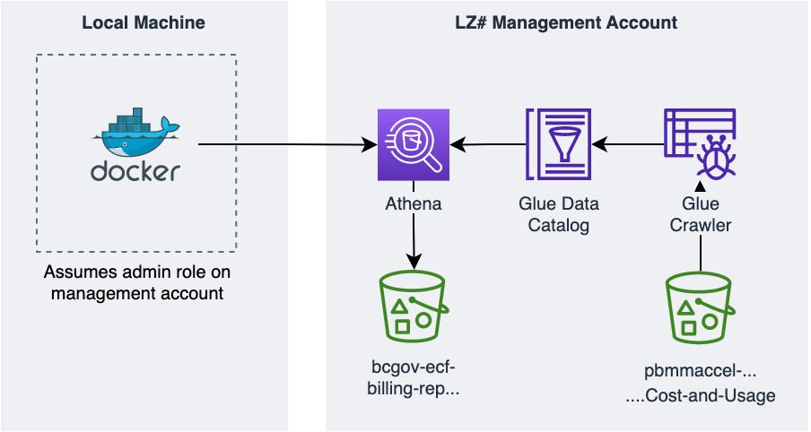
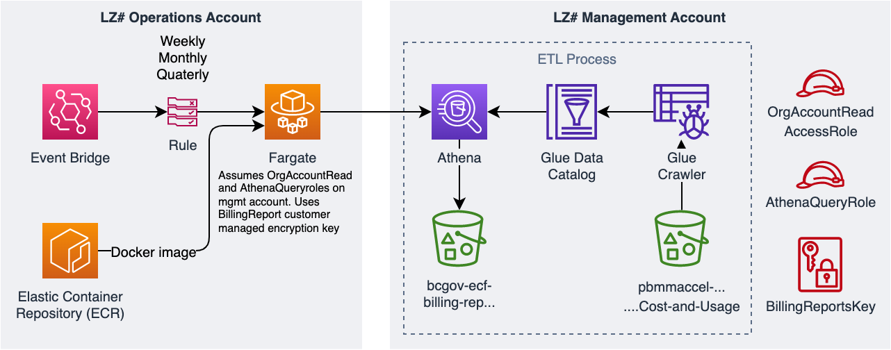

[](./LICENSE)

# OCTK AWS SEA Billing Utility
This repo contains tooling used by the Cloud Pathfinder team to generate and send AWS ECF billing reports.

## Project Status

- [x] Development
- [ ] Production/Maintenance

## Background

The current iteration is based off an earlier solution that leveraged Docker. That version required AWS ECF management account admin privileges and relied on  manual execution on an admin/developer workstation. Arguments were managed by argparse. The solution was cumbersome and did not provide a reliable way to produce weekly, monthly and quarterly reports. A rough sketch of how the solution looked is presented below:



In line with ticket [1068](https://github.com/bcgov/cloud-pathfinder/issues/1068), the solution was ported to run on AWS ECS Fargate. Weekly, monthly and quarterly report generation are now managed by EventBridge. Input arguments that were initially managed by argparse are now supplied by EventBridge as environment variables.

The revised solution still supports generating billing reports for time ranges outside the last billing fiscal (weekly, monthly and quarterly) periods.

## High Level Overview
### AWS Services Used
- Amazon Athena
- Amazon EventBridge
- Amazon Glue
- AWS Elastic Container Repository (ECR)
- AWS Elastic Container Service (ECS)
- Amazon Simple Storage Service (S3)
- Amazon Simple Email Service (SES)

Resources for the current solution is split between the ECF operations and management accounts. Raw billing data is located within an S3 bucket in the ECF management account. Compute operations are performed by resources deployed to the operations account. AWS Glue crawler populates a data catalog in the management account. Athena queries initiated by resources deployed in the operations account extracts raw billing data for a specified date range. This information is saved for further processing in an S3 bucket within the management account.



Further improvements would involve moving Glue and Athena components from the management account to the operations account. In this approach, cross account replication of the `pbmmaccel-master-phase1` S3 bucket would have billing data available in the operations account. At the time of this writing, the `pbmmaccel-master-phase1` bucket size delta month-over-month is no greater than 50GB.


## Prerequisites
- Terraform
  - `brew install terraform`
- AWS CLI
  - `brew install awscli`
- Docker
  - for Mac M1 Chip rosetta is required before Docker install
    - `softwareupdate --install-rosetta`
- Python (local/ manual runs)
  - `brew install python`

## Getting Started
Resources used in the current iteration of this solution are located in three directories:
- **management-account-terraform-resources**: Terraform resources that deployed to the ECF management account. Contains:
  - Glue resources (Crawler and Data Catalog)
  - Role needed to query org accounts
  - Role needed to perform Athena queries against `pbmmaccel-master-phase1`
  - Customer Managed Key (CMK) used to encrypt data
- **operations-account-terraform-resources:** Terraform resources that deployed to the ECF operations account. Contains:
  - Container related resources: ECR, ECS, Fargate and roles
  - Amazon EventBridge resources
  - Data needed for manual runs from local machine. Stored in Parameter Store
- **billing-report-utility:** Python code used by the utility


### Pending Items
- Conversion rate from USD to CAD is provided by [Fixer](https://fixer.io/). We're on the free tier which has no uptime or availability guarantees. The service needs to be revised to something more robust. This is set to be addressed by ticket [1727](https://github.com/bcgov/cloud-pathfinder/issues/1727).
- Monitoring and Alerting: The current iteration does not include monitoring and alerting components. Two key areas that would be beneficial to start with are:
  - SES related metrics
    - Bounce and complaint: We need to ensure these rates are low. Bounce rates 5% or greater will result in an account review. Bounce of 10% or greater, can result in AWS pausing the account's ability to send additional emails till the cause of the high bounce rate is addressed. A good reference material on this can be found at: [Amazon SES Sending review process FAQs](https://docs.aws.amazon.com/ses/latest/dg/faqs-enforcement.html)
    - Send and delivery rates: Would come handy with generating alerts should there be changes in send/delivery patterns (e.g.: emails not sent post quarterly report generation)
  - ECS performance metrics: Would prove beneficial with identifying potential issues during task execution. We want to ensure we are notified should a task fail (e.g.: out of memory, CPU...etc).
- Unit testing: This was not in scope for the current refactoring. Would be beneficial to have some unit tests in place. 


### Generating reports for dates not handled by EventBridge
Python code contained in the `billing-report-utility` directory can be executed locally to generate billing reports for arbitrary date periods. Several environment variables and permissions are needed in order to do so. The required environment variables can be obtained from the parameter store: `/bcgov/billingutility/manual_run/env_vars` located in the corresponding ECF LZ Operations account. These are as follows:

```shell
REPORT_TYPE="Manual"
START_DATE="<YYYY, M, D>" - eg: "2022, 4, 12"
END_DATE="<YYYY, M, D>" - eg: "2022, 4, 26"
DELIVER="True|False" # Be very careful with this as if RECIPIENT_OVERRIDE is not set and Deliver is True here then this will send emails to ALL CLIENTS
RECIPIENT_OVERRIDE="hello.123@localhost" # For testing purposes set this to your own email, it will override all client emails
CARBON_COPY="hello.123@localhost"
ATHENA_QUERY_ROLE_TO_ASSUME_ARN="arn:aws:iam::<LZ#-ManagementAccountID>:role/BCGov-Athena-Cost-and-Usage-Report"
ATHENA_QUERY_DATABASE="cost_and_usage_report_athena_db"
QUERY_ORG_ACCOUNTS_ROLE_TO_ASSUME_ARN="arn:aws:iam::<LZ#-ManagementAccountID>:role/BCGov-Query-Org-Accounts"
ATHENA_QUERY_OUTPUT_BUCKET="bcgov-ecf-billing-reports-output-<LZ#-ManagementAccountID>-ca-central-1"
ATHENA_QUERY_OUTPUT_BUCKET_ARN="arn:aws:s3:::bcgov-ecf-billing-reports-output-<LZ#-ManagementAccountID>-ca-central-1"
CMK_SSE_KMS_ALIAS="arn:aws:kms:ca-central-1:<LZ#-ManagementAccountID>:alias/BCGov-BillingReports"
```
> Note: Running the Python code locally requires several open source libraries. Creating a dedicated `virtualenv` as described [here](https://docs.python.org/3/library/venv.html) is recommended to avoid conflicts/clashes with other Python applications and libraries on your machine.

```shell
$ cd billing-report-utility
$ pip3 install -r requirements.txt
```
Given SES resources are deployed in the ECF LZ operations accounts, you'd need a role in that account to execute the Python script locally. At the time of this writing, the admin role on the operator account is sufficient.

> For local execution, the ECF LZ operations account role must be able to use the CMK corresponding associated with the environment variable: `CMK_SSE_KMS_ALIAS` and also assume corresponding roles associated with environment variables `QUERY_ORG_ACCOUNTS_ROLE_TO_ASSUME_ARN` and `ATHENA_QUERY_ROLE_TO_ASSUME_ARN`. These are resources deployed in the ECF LZ management account. At the time of this writing, the admin role on the operator account is sufficient. As we scale back on permissions, this will likely be revised further.  

Once the appropriate values as indicated above are available, you can easily run the script using the command:

```shell
python3 billing.py
```
Running the utility locally will create files in folders structure below, nested within the `billing-report-utility` directory:
- `output/<guid>/query_results/query_results.csv`  # *LARGE* CSV file containing all, fine-grained billing records for specified period
- `output/<guid>/summarized/charges-YYYY-MM-DD-YYYY-DD-MM-ALL.xls`  # Excel file containing summarized billing records for ALL billing groups for specified period
- `output/<guid>/summarized/charges-YYYY-MM-DD-YYYY-DD-MM-<BILLING_GROUP_NAME>.xls`  # Excel files containing summarized billing records (one file for each  BILLING_GROUP) for specified period.
- `output/<guid>/reports/YYYY-MM--DD-YYYY-MM-DD-BILLING_GROUP_NAME.html`  # HTML billing report (pivot table) for each billing group, with charges grouped by account and service.

### References/Useful Resources
- [Querying Cost and Usage Reports using Amazon Athena](https://docs.aws.amazon.com/cur/latest/userguide/cur-query-athena.html).

## Getting Help or Reporting an Issue

<!--- Example below, modify accordingly --->
To report bugs/issues/feature requests, please file an [issue](../../issues).

## How to Contribute

<!--- Example below, modify accordingly --->
If you would like to contribute, please see our [CONTRIBUTING](./CONTRIBUTING.md) guidelines.

Please note that this project is released with a [Contributor Code of Conduct](./CODE_OF_CONDUCT.md). By participating
in this project you agree to abide by its terms.

## License

    Copyright 2018 Province of British Columbia

    Licensed under the Apache License, Version 2.0 (the "License");
    you may not use this file except in compliance with the License.
    You may obtain a copy of the License at

       http://www.apache.org/licenses/LICENSE-2.0

    Unless required by applicable law or agreed to in writing, software
    distributed under the License is distributed on an "AS IS" BASIS,
    WITHOUT WARRANTIES OR CONDITIONS OF ANY KIND, either express or implied.
    See the License for the specific language governing permissions and
    limitations under the License.
